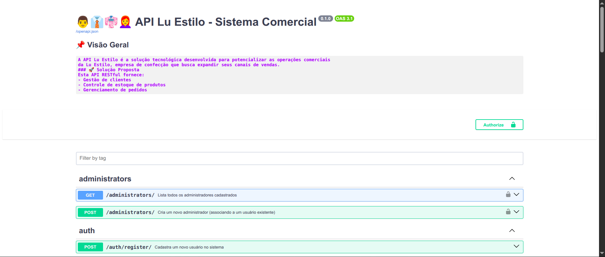

  <section align="center" style="margin-bottom: 2em">
      
    <h4>API da Lu Estilo 🕶️🔥 </h4>
    <div>
      <a href="#configuracao-ambiente">Configuração do ambiente</a> •
      <a href="#testes">Execução dos testes</a> 
    </div>
  </section>

<hr>

<p>Esta API RESTful, desenvolvida para a empresa de confecção Lu Estilo, utiliza o framework FastAPI para proporcionar um gerenciamento eficiente. O sistema oferece funcionalidades para administração de perfis de clientes e administradores, além do controle de produtos e pedidos. Com ele, é possível listar, consultar e gerenciar o estoque de forma prática e intuitiva.</p>

<hr>

## <div id="configuracao-ambiente">🔧 Configuração e execução do ambiente</div>

> Para executar o projeto, certifique-se de que sua máquina possui as seguintes ferramentas:

- [Docker](https://docs.docker.com/engine/)
- [Docker Compose](https://docs.docker.com/compose)

> Passo a passo:

#### Clone o repositório:

```
git clone https://github.com/alcides07/lu-estilo.git
```

#### Acesse o diretório gerado:

```
cd lu-estilo/api
```

#### Construa e execute a aplicação:

```
docker-compose -f docker-compose-dev.yml up --build
```

#### Acesse a documentação da API (openAPI):

> A API possui documentação de todas as suas rotas, incluindo exemplos e cenários de erro previstos, proporcionando o maior suporte possível.

```
http://localhost:8000/docs/
```

> Você vai se deparar com:



#### Crie um usuário

POST

```
http://localhost:8000/auth/register/
```

> Realize o login pelo botão _Authorize_ no canto superior direito.

#### Associe-se a um perfil e comece a usá-lo!

> Associe-se como cliente (POST /clients/) ou administrador (POST /administrators/). Caso deseje, é possível vincular-se a ambos os perfis simultaneamente, acumulando suas respectivas permissões

> Após a associação, para acessar todas as funcionalidades corretamente, realize logout e faça login novamente para que suas permissões sejam atualizadas conforme seu novo papel

</details>

<details>
<summary><h3>Execução com Make (Makefile) </h3></summary>

> A utilização do Make nesse caso serve apenas para simplificar o processo de execução. Nos bastidores, quem realiza a tarefa é o docker-compose.

#### Execute a aplicação:

```
make full-dev
```

</details>

## <div id="testes">🧪 Execução dos testes </div>

Os testes foram desenvolvidos utilizando as ferramentas `pytest`, `factory-boy` e `faker`, que auxiliam na criação de objetos fictícios conforme necessário, proporcionando a construção automatizada dos cenários de teste.

Você pode executar os testes utilizando qualquer um dos seguintes comandos:

`docker exec -it lu-api-dev pytest` | `make test`
